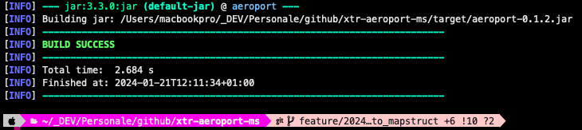
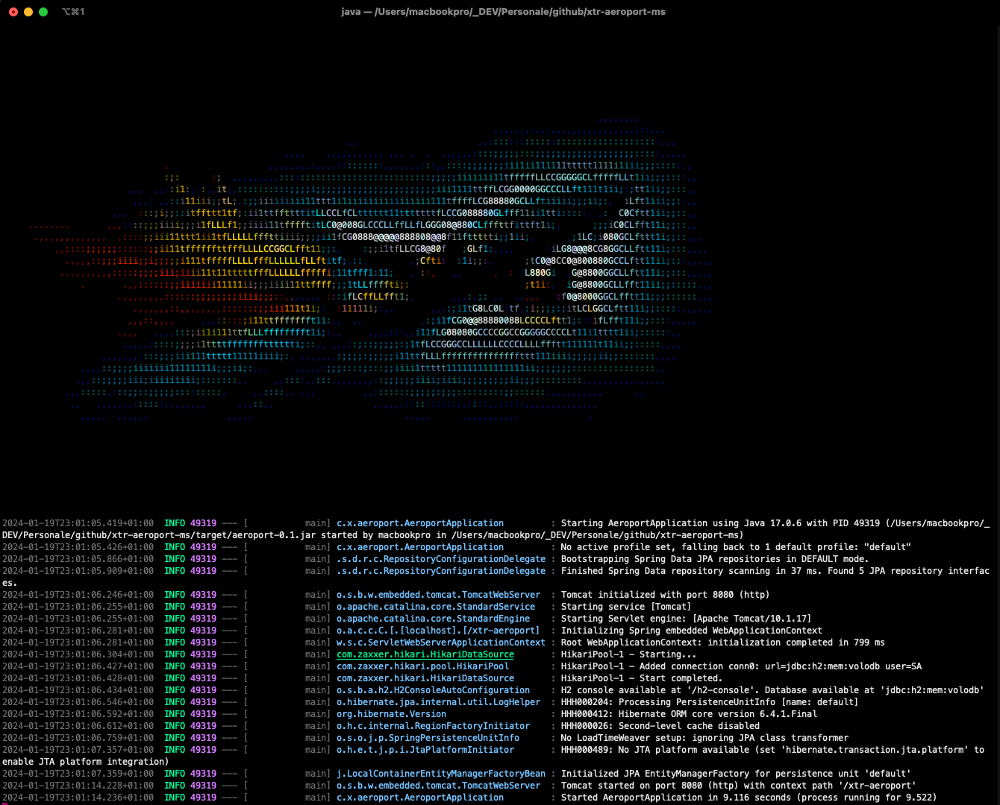

<a name="readme-top"></a>

[![Contributors][contributors-shield]][contributors-url]
[![Forks][forks-shield]][forks-url]
[![Stargazers][stars-shield]][stars-url]
[![Issues][issues-shield]][issues-url]
[![Apache License][license-shield]][license-url]
[![LinkedIn][linkedin-shield]][linkedin-url]


<!-- PROJECT LOGO -->
<br />
<div align="center">
  <a href="">
    
  </a>

  <h3 align="center">Aeroport MS</h3>

  <p align="center">
   **xtr-aeroports-ms** è un micro-servizio dedicato all'accesso delle informazioni sugli aeroporti in tutto il mondo.
    <br />
    <a href="https://github.com/XtremeAlex/xtr-aeroport-ms"><strong>Explore the docs »</strong></a>
    <br />
    <br />
    <a href="">View Demo Live (in progres...)</a>
    ·
    <a href="/issues">Report Bug</a>
    ·
    <a href="/issues">Request Feature</a>
  </p>
</div>


<!-- TABLE OF CONTENTS -->
<details>
  <summary>Sommario</summary>
  <ol>
    <li>
      <a href="#info-sul-progetto">Info sul progetto</a>
      <ul>
        <li><a href="#invito-alla-collaborazione">Invito alla Collaborazione</a></li>
      </ul>
      <ul>
        <li><a href="#stack-tecnologico">Stack Tecnologico</a></li>
      </ul>
    </li>
    <li>
      <a href="#getting-started">Getting Started</a>
      <ul>
        <li><a href="#prerequisiti">Prerequisiti</a></li>
        <li><a href="#compilazione">Compilazione</a></li>
      </ul>
    </li>
    <li><a href="#play-&-test">Play & Test</a></li>
    <li><a href="#roadmap">Roadmap</a></li>
    <li><a href="#aiutami">Aiutami</a></li>
    <li><a href="#contributing">Contributing</a></li>
    <li><a href="#license">License</a></li>
    <li><a href="#contact">Contact</a></li>
    <li><a href="#ringraziamenti">Ringraziamenti</a></li>
  </ol>
</details>


<!-- ABOUT THE PROJECT -->
## Info sul progetto

[![Product Name Screen Shot][product-screenshot]]()

Durante il poco tempo che riesco a strappare al lavoro e agli altri impegni, mi diverto a sperimentare con tecnologie, e questa ne è una piccola dimostrazione.
Questo progetto nasce come piattaforma sperimentale, l'obiettivo è fornire un set di API robuste per accedere a informazioni dettagliate sugli aeroporti e le rotte aeree a livello globale.  
Questa iniziativa, partita come un esperimento personale, si è evoluta in una solida base per testare nuovi pattern, metodologie, e tecnologie.
È solo uno dei numerosi moduli che prevedo di rilasciare, con l'intento di condividerli e arricchirli attraverso il contributo della community.


### Invito alla Collaborazione
Il contributo di idee, codice e feedback è sempre benvenuto e incoraggiato per diversi motivi:
* Sperimentare con Nuove Tecnologie
  * Questo progetto mette alla prova le proprie competenze in un contesto realistico.
* Crescita Collettiva
  * Collaborando, possiamo imparare gli uni dagli altri, scambiare idee e crescere professionalmente insieme.
* Base per Sviluppi Futuri
  * Il progetto è strutturato seguendo le best practice, rendendolo un ottimo punto di partenza per i tuoi sviluppi futuri.
  * L'approccio "Enterprise Like" garantisce che le soluzione sia di alta qualità e pronta per l'uso in contesti aziendali.

Grazie a tutti quelli che hanno o vorranno contribuire ad espandere qusto progetto.

<p align="right">(<a href="#readme-top">back to top</a>)</p>

### Stack Tecnologico
Le tecnologie/framework e SO usati:
* [![Java][java.shield]][java.url]
* [![Spring][spring.shield]][spring.url]
* [![Windows][Windows.shield]][Windows.url]
* [![Linux][Linux.shield]][Linux.url]
* [![Macos][Macos.shield]][Macos.url]
* [![GitHub][GitHub.shield]][GitHub.url]

<p align="right">(<a href="#readme-top">back to top</a>)</p>

<!-- GETTING STARTED -->
## Getting Started
Questo progetto è configurato per usare Maven per la gestione delle dipendenze e la compilazione.
È sviluppato con Spring 3 e Java 17 e può essere facilmente avviato e testato in un ambiente locale.

### Prerequisiti
Per utilizzare e contribuire a questo progetto, avrai bisogno di installare:
- Git (2.43.0)
- Java OJDK (Graal Versione 17)
- Maven (Apache Maven 3.9.6)

**Contenent**

```
.
├── main
│   ├── java
│   │   └── com
│   │       └── xtremealex
│   │           └── aeroport
│   │               ├── AeroportApplication.java
│   │               ├── common
│   │               │   └── models
│   │               │       ├── ErrorCode.java
│   │               │       ├── json
│   │               │       │   ├── AirportJson.java
│   │               │       │   └── CountryJson.java
│   │               │       ├── request
│   │               │       │   └── AirportSearchRequest.java
│   │               │       └── response
│   │               │           ├── ResponseWrapper.java
│   │               │           ├── ResponseWrapperBuilder.java
│   │               │           ├── airports
│   │               │           │   ├── AirportDTO.java
│   │               │           │   └── AirportTypeDTO.java
│   │               │           ├── countries
│   │               │           │   └── CountryDTO.java
│   │               │           └── flights
│   │               │               └── VoloDTO.java
│   │               ├── configuration
│   │               │   ├── MyConfig.java
│   │               │   └── MyConfigMvc.java
│   │               ├── controller
│   │               │   ├── SearchAirport.java
│   │               │   ├── SearchAirportType.java
│   │               │   ├── SearchCountries.java
│   │               │   ├── SearchFlights.java
│   │               │   └── TestController.java
│   │               ├── entity
│   │               │   ├── AirportEntity.java
│   │               │   ├── VoloEntity.java
│   │               │   ├── typological
│   │               │   │   ├── AirportTypeTypology.java
│   │               │   │   └── CountryTypology.java
│   │               │   └── view
│   │               │       └── CountryAirportCountView.java
│   │               ├── mapper
│   │               │   ├── IdDecodeConverter.java
│   │               │   ├── IdEncodeConverter.java
│   │               │   └── ListIdEncodeConverter.java
│   │               ├── repository
│   │               │   ├── AirportRepository.java
│   │               │   ├── AirportTypeRepository.java
│   │               │   ├── CountryAirportRepository.java
│   │               │   ├── CountryTypeRepository.java
│   │               │   └── VoloRepository.java
│   │               └── service
│   │                   ├── IAirportService.java
│   │                   ├── IAirportTypeService.java
│   │                   ├── IEncryptionService.java
│   │                   ├── impl
│   │                   │   ├── AirportService.java
│   │                   │   ├── AirportTypeService.java
│   │                   │   └── EncryptionService.java
│   │                   └── provvisorioBatchInit
│   │                       ├── AirportDataService.java
│   │                       └── CountryService.java
│   └── resources
│       ├── application.yml
│       ├── banner.txt
│       ├── data.sql
│       ├── dataset
│       │   ├── airports
│       │   │   └── world-airport.json
│       │   └── country
│       │       ├── countries-flag.json
│       │       └── world-cities.json
│       └── schema.sql
└── test
    └── java
        └── com
            └── xtremealex
                └── aeroport
                    └── AeroportApplicationTests.java

```

### Compilazione

**Clonare il Repository**

1. Per iniziare, clona il repository `xtr-aeroports-ms` sul tuo computer locale usando Git.
   Apri il terminale e esegui il seguente comando:
    ```
    git clone https://<repository>/xtr-aeroports-ms.git cd
    xtr-aeroports-ms
    ```

2. Una volta clonato il repository, puoi compilare il progetto utilizzando Maven.
   Esegui il seguente comando nella directory radice del progetto:
    ```
    mvn clean package -DskipTests
    ```
   

3. Ora puoi avviarlo eseguendo:
    ```
    java -jar ./target/aeroport-0.1.jar
    ```
   


<p align="right">(<a href="#readme-top">back to top</a>)</p>


<!-- USAGE EXAMPLES -->
## Play & Test


1. Controller:

   1. getAirportsBy
   ```
   @GetMapping("/getAirportsBy")
    public ResponseEntity<?> getAirportsBy(@RequestParam(required = false) Set<String> types,
                                          @RequestParam(required = false) String isoCountry,
                                          @RequestParam(required = false) String name,
                                          @RequestParam(defaultValue = "0") int pageNumber,
                                          @RequestParam(defaultValue = "12") int pageSize,
                                          @RequestParam(required = false) String sortField,
                                          @RequestParam(defaultValue = "ASC") String sortDir) {
                                          < code... >
    }
                                        
    URL: http://localhost:8080/xtr-aeroport/getAirportsBy?pageNumber=0&pageSize=4&sortField=name&types=1,2,3,4,5,6,7,8,9
    ```
   2. searchAirports
     ```
    @PostMapping("/searchAirports")
    public ResponseEntity<?> searchAirports(@RequestBody AirportSearchRequest searchRequest) {                      
                                          < code... >                              
    }
                                        
    URL: http://localhost:8080/xtr-aeroport/searchAirports
    ```

<p align="right">(<a href="#readme-top">back to top</a>)</p>


<!-- ROADMAP -->
## Roadmap

- [x] Creare Verticale SearchAirport
- [x] Creare Verticale SearchAirportType
- [ ] Sostituire MolderMapper con Mapstruct
- [ ] Compilare Nativamente con Graal
- [ ] Creare tutti i Dockerfile e Docker-Compose per
    - [ ] Graal JDK17
    - [ ] Graal JDK17 (nativo)
    - [ ] OpenJDK17
    - [ ] altri...
- [ ] Testare il tutto riportando le Statistiche

Consulta [open issues](https://github.com/XtremeAlex/xtr-aeroport-ms/issues) per una lista completa delle funzionalità proposte (bug e feature).
s
<p align="right">(<a href="#readme-top">back to top</a>)</p>


<!-- CONTRIBUTING -->
## Aiutami

L'aiuto di tutti rende la comunità open source un luogo incredibile per imparare, ispirarsi e creare.
Qualsiasi contributo tu possa fornire è **enormemente apprezzato**.

Se hai un suggerimento che potrebbe migliorare questo progetto, per favore effettua un fork del repository e crea una pull request.  
Puoi anche semplicemente aprire un problema con il tag "feature".
Non dimenticare di mettere una stella al progetto!  
Grazie ancora!


## Contributing

Contributions are what make the open source community such an amazing place to learn, inspire, and create.  
Any contributions you make are **greatly appreciated**.

If you have a suggestion that would make this better, please fork the repo and create a pull request. You can also simply open an issue with the tag "feature".
Don't forget to give the project a star!  
Thanks again!

## Git Command

1. Fork the Project
2. Create your Feature Branch (`git checkout -b feature/SexToysFeature`)
3. Commit your Changes (`git commit -m 'Add some SexToysFeature'`)
4. Push to the Branch (`git push origin feature/SexToysFeature`)se
5. Open a Pull Request

<p align="right">(<a href="#readme-top">back to top</a>)</p>


<!-- LICENSE -->
## License

Distributed under the Apache License. See `LICENSE` for more information.

<p align="right">(<a href="#readme-top">back to top</a>)</p>


<!-- CONTACT -->
## Contact

Andrei Alexandru Dabija - [@linkedin](https://www.linkedin.com/in/andrei-alexandru-dabija/) - /andrei-alexandru-dabija

GitHub Link: [https://github.com/XtremeAlex](https://github.com/XtremeAlex)

<p align="right">(<a href="#readme-top">back to top</a>)</p>


<!-- ACKNOWLEDGMENTS -->
## Ringraziamenti

Inserisco questi url che potrebbero essere utili:

* [Choose an Open Source License](https://choosealicense.com)
* [GitHub Emoji Cheat Sheet](https://www.webpagefx.com/tools/emoji-cheat-sheet)
* [Malven's Flexbox Cheatsheet](https://flexbox.malven.co/)
* [Malven's Grid Cheatsheet](https://grid.malven.co/)
* [Img Shields](https://shields.io)
* [GitHub Pages](https://pages.github.com)
* [Font Awesome](https://fontawesome.com)
* [React Icons](https://react-icons.github.io/react-icons/search)

<p align="right">(<a href="#readme-top">back to top</a>)</p>


<!-- MARKDOWN LINKS & IMAGES -->
<!-- https://www.markdownguide.org/basic-syntax/#reference-style-links -->
[contributors-shield]: https://img.shields.io/github/contributors/XtremeAlex/xtr-aeroport-ms.svg?style=for-the-badge
[contributors-url]: https://github.com/XtremeAlex/xtr-aeroport-ms/graphs/contributors
[forks-shield]: https://img.shields.io/github/forks/XtremeAlex/xtr-aeroport-ms.svg?style=for-the-badge
[forks-url]: https://github.com/XtremeAlex/xtr-aeroport-ms/network/members
[stars-shield]: https://img.shields.io/github/stars/XtremeAlex/xtr-aeroport-ms.svg?style=for-the-badge
[stars-url]: https://github.com/XtremeAlex/xtr-aeroport-ms/stargazers
[issues-shield]: https://img.shields.io/github/issues/XtremeAlex/xtr-aeroport-ms.svg?style=for-the-badge
[issues-url]: https://github.com/XtremeAlex/xtr-aeroport-ms/issues
[license-shield]: https://img.shields.io/github/license/XtremeAlex/xtr-aeroport-ms.svg?style=for-the-badge
[license-url]: https://github.com/XtremeAlex/xtr-aeroport-ms/blob/develop/LICENSE
[linkedin-shield]: https://img.shields.io/badge/LinkedIn-0077B5?style=for-the-badge&logo=linkedin&logoColor=white
[linkedin-url]: https://www.linkedin.com/in/andrei-alexandru-dabija/
[product-logo]: _assets/images/screenshot_black.png
[product-screenshot]: _assets/images/screenshot.png
[Next.js]: https://img.shields.io/badge/next.js-000000?style=for-the-badge&logo=nextdotjs&logoColor=white
[Next-url]: https://nextjs.org/
[React.js]: https://img.shields.io/badge/React-20232A?style=for-the-badge&logo=react&logoColor=61DAFB
[React-url]: https://reactjs.org/
[Vue.js]: https://img.shields.io/badge/Vue.js-35495E?style=for-the-badge&logo=vuedotjs&logoColor=4FC08D
[Vue-url]: https://vuejs.org/
[Angular.io]: https://img.shields.io/badge/Angular-DD0031?style=for-the-badge&logo=angular&logoColor=white
[Angular-url]: https://angular.io/
[Svelte.dev]: https://img.shields.io/badge/Svelte-4A4A55?style=for-the-badge&logo=svelte&logoColor=FF3E00
[Svelte-url]: https://svelte.dev/
[Laravel.com]: https://img.shields.io/badge/Laravel-FF2D20?style=for-the-badge&logo=laravel&logoColor=white
[Laravel-url]: https://laravel.com
[Bootstrap.com]: https://img.shields.io/badge/Bootstrap-563D7C?style=for-the-badge&logo=bootstrap&logoColor=white
[Bootstrap-url]: https://getbootstrap.com
[JQuery.com]: https://img.shields.io/badge/jQuery-0769AD?style=for-the-badge&logo=jquery&logoColor=white
[JQuery-url]: https://jquery.com 
[GitHub.shield]: https://img.shields.io/badge/GitHub-100000?style=for-the-badge&logo=github&logoColor=white
[GitHub.url]: https://img.shields.io/github/issues/XtremeAlex/
[Linux.shield]: https://img.shields.io/badge/Linux-FCC624?style=for-the-badge&logo=linux&logoColor=black
[Linux.url]: https://wikipedia.org/wiki/Linux
[Macos.shield]:  https://img.shields.io/badge/mac%20os-000000?style=for-the-badge&logo=apple&logoColor=white
[Macos.url]: https://wikipedia.org/wiki/MacOS
[Windows.shield]: https://img.shields.io/badge/Windows-0078D6?style=for-the-badge&logo=windows&logoColor=white
[Windows.url]: https://wikipedia.org/wiki/Windows10
[Java.shield]: https://img.shields.io/badge/Java-ED8B00?style=for-the-badge&logo=openjdk&logoColor=white
[Java.url]: https://wikipedia.org/wiki/Java_(programming_language)
[Spring.shield]: https://img.shields.io/badge/Spring-6DB33F?style=for-the-badge&logo=spring&logoColor=white
[Spring.url]: https://spring.io
[Paypal.shield]: https://img.shields.io/badge/PayPal-00457C?style=for-the-badge&logo=paypal&logoColor=white
[Paypal.url]: https://www.paypal.com
[Mozilla.shield]: https://img.shields.io/badge/Firefox_Browser-FF7139?style=for-the-badge&logo=Firefox-Browser&logoColor=white
[Mozilla.url]: https://www.mozilla.org
